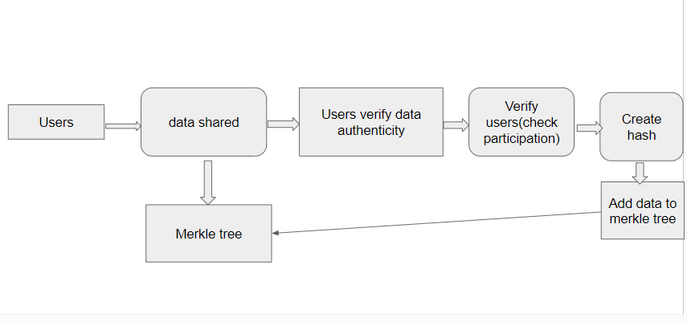

# SilentProof Guardian

**Guard your data, for in its protection lies the essence of digital freedom.**

SilentProof Guardian, a decentralized zkApp. prioritizes privacy. It empowers secure, anonymous information shareing.

## Problem Statement

The majority of individuals are not proponents of war. However, once warfare becomes a reality, the rapid dissemination of misinformation and disinformation ensues. Many people share information on social platforms that claim to have sufficient privacy and security measures, but users can still be easily traced. Consequently, individuals refrain from sharing authentic information. Additionally, anyone responding to shared information can also be traced. Another concern is that the information shared is susceptible to manipulation by companies based on the requirements of government entities.

## Solution

SilentProof Guardian, a decentralized zkApp built using SnarkJS, zero knowledge proofs. It aims to enable anonymous and secure information while preserving user privacy.

## documentation



The concept behind the privacy-based information sharing app revolves around creating a secure platform for sharing crucial information reagarding anything.

The privacy-based information sharing app begins by setting up an initial state that includes the count of participants and a Merkle tree root designed to store hashed user information. This Merkle tree operates by securely holding the hash values of usernames and corresponding cryptographic random numbers, ensuring a privacy-centric environment for data storage.

**user->hash("name","salt")**


In the future, there is a strategic shift planned from using usernames to government IDs for advanced verification. The application leverages zero-knowledge proofs to authenticate users, confirming their inclusion in the Merkle tree. Users actively engage in data sharing and verification processes, and the app dynamically updates the Merkle tree with their information while incrementing the number of participants.

This application currently exists in its basic version and lacks the full implementation of essential features. It is a rudimentary iteration that does not encompass all the functionalities required for optimal performance and user experience. Further development and enhancement are necessary to incorporate the complete set of features and functionalities essential for the application's intended purpose.

## impacts

- Facilitates individuals in sharing information without compromising their identities, establishing a secure space for open expression.

- Particularly valuable in regions with limited freedom of speech, allowing users to endorse various causes without the concern of facing repercussions.

- The privacy-centric design of the information-sharing app is poised to attract a diverse user base, especially those who highly value their privacy and aspire to contribute positively through shared information.


This template uses TypeScript.

## How to build

```sh
npm run build
```

## How to run tests

```sh
npm run test
npm run testw # watch mode
```

## How to run coverage

```sh
npm run coverage
```

